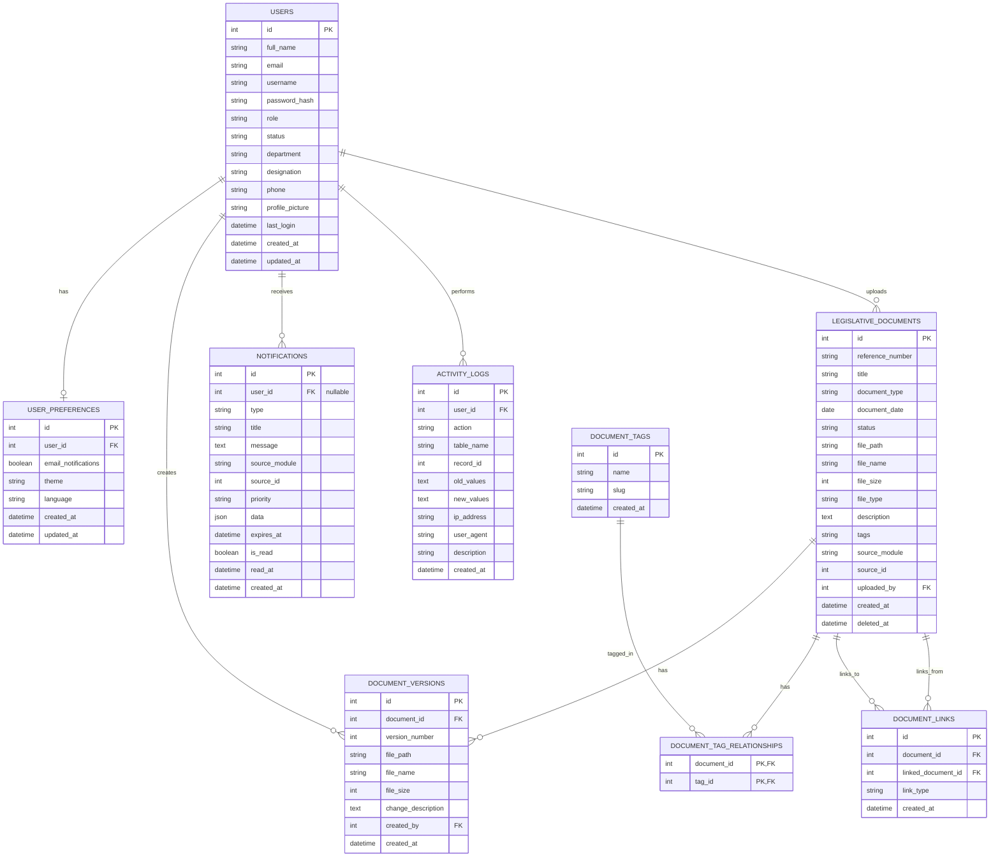

# Database Entity Relationship Diagram (ERD)

This document provides the ERD for the Legislative Local Records Management System (LLRMSystem) database (`lrms_db`), visualized using [Mermaid.js](https://mermaid.js.org/).

## ERD Diagram

## Relationships Description

- **Users**: Central entity. Users upload documents, perform actions (logged), receive notifications, and create document versions.
- **Legislative Documents**: Main content entity. Documents can be linked to other documents (relationships like "supersedes" or "amends"), can have multiple tags, and maintain a version history.
- **Activity Logs**: Tracks every major action performed by users for audit purposes.
- **Notifications**: System-wide and per-user alerts. NULL `user_id` represents a broadcast notification.
- **Versions**: Each time a document is updated, a new entry is created here to maintain history.
- **Tags**: Categorization system with a many-to-many relationship to documents.
